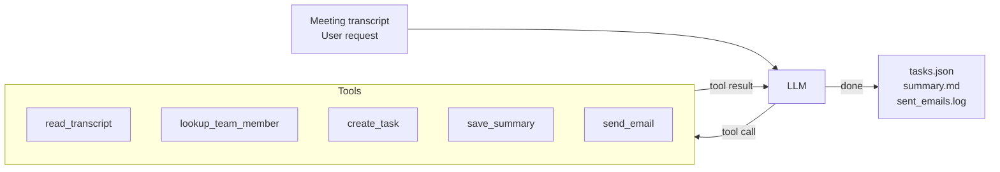

A local AI agent that reads meeting transcripts and turns them into structured outputs: action items, a markdown summary, and a follow-up email. Runs entirely on your hardware. Your personal or private data is not shared with any model provider.



## What it does

Given a meeting transcript, the agent:

1. Reads the transcript
2. Identifies every action item (owner, due date, description)
3. Looks up each owner in the local team directory
4. Creates a task record for each action item (`data/tasks.json`)
5. Saves a structured markdown summary (`data/summaries/`)
6. Drafts and "sends" a follow-up email (`data/sent_emails.log`)

## Setup

<Steps>
  <Step title="Install llama.cpp">
    Provides `llama-server`:
    
    <Tabs>
      <Tab title="macOS">
        ```bash
        brew install llama.cpp
        ```
      </Tab>
      <Tab title="Linux / Windows">
        Download a prebuilt binary from [llama.cpp releases](https://github.com/ggml-org/llama.cpp/releases)
      </Tab>
    </Tabs>
  </Step>

  <Step title="Clone the repository">
    ```bash
    git clone https://github.com/Liquid4All/cookbook.git
    cd cookbook/examples/meeting-intelligence-agent
    ```
  </Step>

  <Step title="Install Python dependencies">
    ```bash
    uv sync
    ```
  </Step>
</Steps>

## Usage

### Interactive mode

```bash
uv run mia --model LiquidAI/LFM2-24B-A2B-GGUF:Q4_0
> Process the meeting transcript in data/sample_transcript.txt
```

### Non-interactive mode

```bash
uv run mia --model LiquidAI/LFM2-24B-A2B-GGUF:Q4_0 -p "Process data/sample_transcript.txt and save the summary as sprint-42.md"
```

### With an already-running llama-server

```bash
# Start the server (once)
llama-server \
  --port 8080 \
  --ctx-size 32768 \
  --n-gpu-layers 99 \
  --flash-attn on \
  --jinja \
  --temp 0.1 \
  --top-k 50 \
  --repeat-penalty 1.05 \
  -hf LiquidAI/LFM2-24B-A2B-GGUF:Q4_0

# Then run the agent (server is reused across runs)
uv run mia
> Process the meeting transcript in data/sample_transcript.txt
```

## Benchmark

10-task suite covering easy → hard agentic scenarios, tested against `LiquidAI/LFM2-24B-A2B-GGUF:Q4_0`:

| # | Difficulty | Task | Pass | Time |
|---|---|---|:---:|---:|
| 1 | easy | Read transcript and list attendees | ✓ | 6.7s |
| 2 | easy | Look up one team member | ✓ | 5.1s |
| 3 | easy | Create one explicit task | ✓ | 6.1s |
| 4 | medium | Look up three team members | ✓ | 26.7s |
| 5 | medium | Create three tasks from a given list | ✓ | 22.4s |
| 6 | medium | Read transcript and save a structured summary | ✓ | 19.0s |
| 7 | hard | Full pipeline: tasks + summary + email | ✓ | 80.5s |
| 8 | hard | Detect and flag unassigned action item | ✓ | 103.6s |
| 9 | hard | Default due dates for items without explicit deadlines | ✓ | 47.8s |
| 10 | hard | Full pipeline: custom filename and targeted email recipients | ✓ | 51.7s |

**Score: 10/10**

### Run the benchmark

<CodeGroup>
  ```bash All tasks
  uv run benchmark/run.py --model LiquidAI/LFM2-24B-A2B-GGUF:Q4_0
  ```

  ```bash Subset of tasks
  uv run benchmark/run.py --model LiquidAI/LFM2-24B-A2B-GGUF:Q4_0 --task 7,8,9,10
  ```
</CodeGroup>

## Demo outputs

After running the agent on `data/sample_transcript.txt`:

```bash
cat data/tasks.json          # structured task records
cat data/summaries/*.md      # markdown meeting summary
cat data/sent_emails.log     # follow-up email log
```

## Configuration

| Environment variable    | Default                      | Description                        |
|-------------------------|------------------------------|------------------------------------||
| `MIA_LOCAL_BASE_URL`    | `http://localhost:8080/v1`   | llama.cpp server URL               |
| `MIA_LOCAL_MODEL`       | `local`                      | Model name or HuggingFace path     |
| `MIA_LOCAL_CTX_SIZE`    | `32768`                      | Context window size                |
| `MIA_LOCAL_GPU_LAYERS`  | `99`                         | GPU layers to offload (0 = CPU)    |

## Source code

View the complete source code on [GitHub](https://github.com/Liquid4All/cookbook/tree/main/examples/meeting-intelligence-agent).
